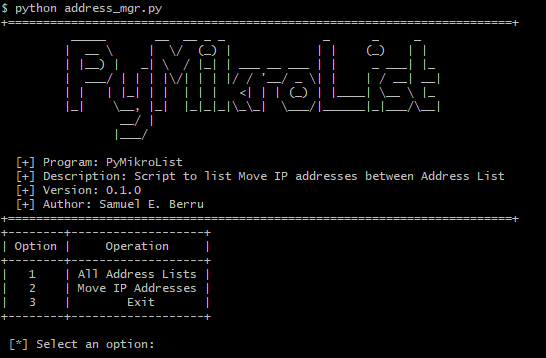

 
# **Usando PyMikroList**

Este programa es una herramienta útil para el manejo de listas de direcciones IP en un firewall. El objetivo principal es permitir al usuario agregar o mover direcciones IP entre diferentes listas de direcciones IP. 

## Requerimientos

Previamente tienes que tener instalado Python3 

- configparser
- laiarturs-ros-api
- openpyxl
- pandas
- paramiko
- prettytable
- pyfiglet


# **Primeros Pasos**

Previamente debes tener instalado ```Python``` correctamente e instalar el paquete ```virtualenv``` en tu equipo!!

* Clona el Proyecto y dirigete dentro del directorio.  

    ```bash
    git clone https://github.com/samuelE09/PyMikroList.git
    cd PyMikroList
    ```

* Dentro de la Carpeta, crea y activa el Entorno Virtual

    ```bash
    python -m virtualvenv venv
    
    Windows - recommendation to use git-bash terminal 
    .\venv\Scripts\activate

    MacOS or Linux
    source venv/bin/activate
    ```

* Instala los requerimientos

    ```bash
    pip install -r requirements.txt
    ```

* Ejecuta el Programa

    ```bash
    python address_mgr.py
    ```
    
# **Observaciones**

En caso ocurra algun problema a ejecutar el comando ```pip install -r requirements.txt ``` instalar los modulos de manera individual

* Instalando Configparser

    ```bash
    pip install configparser
    ```
    
* Instalando laiarturs-ros-api

    ```bash
    pip install laiarturs-ros-api
    ```
    
* Instalando openpyxl

    ```bash
    pip install openpyxl
    ```
* Instalando pandas

    ```bash
    pip install pandas
    ```
* Instalando paramiko

    ```bash
    pip install paramiko
    ```
    
* Instalando prettytable

    ```bash
    pip install prettytable
    ```

* Instalando pyfiglet

    ```bash
    pip install pyfiglet
    ```
    
# **Programa en Acción**

## **Preparacion del Sistema**

Se tiene una lista de Direcciones Ip guardadas en un archivo Excel con el siguiente formato de Tabla 

> **Nota:**
> La tabla debe tener los mismo nombres de columnas o almenos el nombre de la columna [Dirección IP]


Agrega el nombre de tu archivo excel en ```settings.ini```

Se tiene configurados las Address List en el equipo Mikrotik 


## **Ejecutamos el Programa**

Una vez instalado todos los modulos, porcederemos a ejecutar el programa en nuestra terminal usando ``` python address_mgr.py ```




### *Listando las Address List*

Seleccionamos la opción 1 y nos mostrara en una tabla las Address List configuradas en nuestro Equipo Router Mikrotik


Ahora teniendo claro nuestras ``` Address-List ```  seleccionamos la opción 2 y nos pedirá a que lista deseamos mover las Direcciones IP guardadas en el Archivo de Excel


Luego de Mover las Direcciones IP, verificamos el Resultado


# **Contacto**

<h3 align="left"> 💼 Connect with me:</h3>

 - 📫 Reach me at: **sberrualvarado09@gmail.com**

</br>

<p align="left">
<a href="https://linkedin.com/in/sberrualvarado2496" target="blank"></a>
<a href="https://twitter.com/samuel24_dev" target="blank"></a>
<a href="https://instagram.com/samuel_enrique24" target="blank"></a>
</p>
</br>

<h3> Te gustó mi trabajo? </h3>

No dudes en apoyarme y/o contactame

<a href="https://www.paypal.com/donate/?hosted_button_id=FXLEYP4FXC5B2" target="_blank">
  
</a>

<hr>
<h3 align="center"> 😊 Thanks for your visit! 😊</h3>
<p  align="center">
This repository has been created with a lot of ❤️ </br>
¡Come back soon!
</p>


